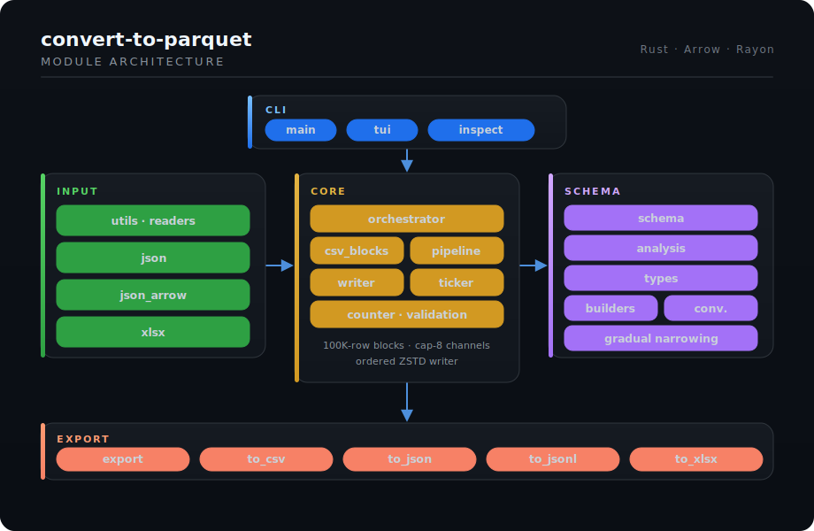
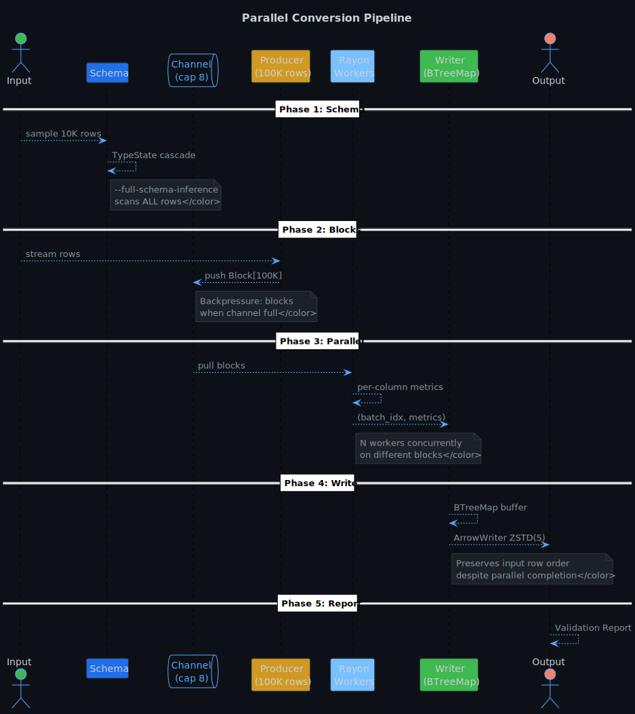
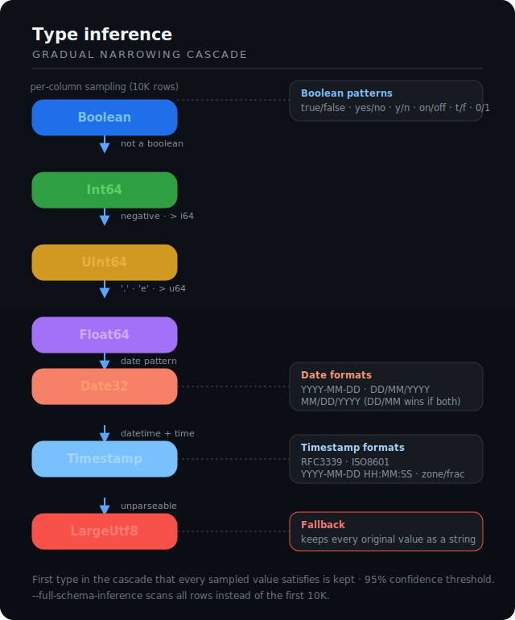

# 🦀 convert-to-parquet

[](https://www.rust-lang.org/)
[](LICENSE)
[](https://gildas-le-drogoff.github.io/convert_to_parquet/)
[](https://github.com/gildas-le-drogoff/convert-to-parquet-rust)

Convert delimited text (CSV, TSV, PSV), spreadsheets (XLSX, ODS, XLS), JSON/JSONL/NDJSON, and Parquet files — with automatic schema inference, parallel processing, and compressed output.

<table>
<tr>
<td width="50%" valign="top">

### Input formats

| Format     | Support                    |
| ---------- | -------------------------- |
| CSV / TSV  | any delimiter, auto-detect |
| XLSX/XLSM  | streaming cell-by-cell     |
| XLSB       | streaming                  |
| XLS / ODS  | non-streaming              |
| JSON/JSONL | array, object, NDJSON      |
| Parquet    | inspect, re-export         |
| Gzip/Zstd  | transparent decompression  |

</td>
<td width="50%" valign="top">

### Output formats

| Format  | Direction       |
| ------- | --------------- |
| Parquet | ZSTD compressed |
| CSV     | `--to-csv`      |
| JSONL   | `--to-jsonl`    |

### Key features

- **Auto schema inference** — gradual narrowing per column
- **Parallel processing** — Rayon + crossbeam channels
- **100K-row blocks** — bounded memory, backpressure
- **Validation report** — null/error/valid % per column
- **Full-schema mode** — scan entire file (not just 10K)

</td>
</tr>
</table>

<p align="center">
  
</p>

## Architecture

<p align="center">
  
</p>

## Pipeline

Blocks of 100,000 rows are streamed through bounded crossbeam channels (capacity 8). Rayon's `par_bridge` analyzes multiple blocks concurrently. An ordered Parquet writer reassembles results via `BTreeMap`, preserving row order while maintaining throughput.

<p align="center">
  
</p>

## Type inference

Each column's type is determined by **gradual narrowing**: every sampled value rules out incompatible types. The first matching type in the cascade is kept.

<p align="center">
  
</p>

**Null handling**: Values `null`, `NULL`, `None`, `NaN`, `N/A`, `na`, `nd`, `nr`, `-`, `--`, and empty strings are treated as null regardless of column type.

**Ambiguous dates** (`01/02/2024`): tested in order `DD/MM/YYYY` → `MM/DD/YYYY`. The first successful parse wins. If both are valid, `DD/MM/YYYY` is retained.

## Install

```bash
cargo build --release
# binary at target/release/convert_to_parquet
```

Or install system-wide:

```bash
make install                        # binary + man page → /usr/local
make install PREFIX=~/.local        # user install
```

## Usage

### Basic conversion

```bash
convert_to_parquet file.csv             # → file.parquet
convert_to_parquet data.csv -o out/     # → out/data.parquet
convert_to_parquet *.csv                # batch / glob
```

### Compressed input

```bash
convert_to_parquet logs.csv.gz          # auto-decompress gzip
convert_to_parquet data.csv.zst         # auto-decompress zstd
bzcat data.csv.bz2 | convert_to_parquet -   # bzip2 via stdin
```

### Spreadsheets & JSON

```bash
convert_to_parquet data.xlsx            # → data__Sheet1.parquet, …
convert_to_parquet records.json         # → records.parquet
convert_to_parquet logs.jsonl           # → logs.parquet
```

### Delimiter override

```bash
convert_to_parquet file.pipe -d '|'
convert_to_parquet file.tsv -d '\t'     # skip auto-detect
```

### Inverse: Parquet → CSV / JSONL

```bash
convert_to_parquet --to-csv data.parquet -o data.csv
convert_to_parquet --to-jsonl data.parquet -o data.jsonl
convert_to_parquet --to-csv *.parquet --output csv_out/
```

### Inspect schema

```bash
convert_to_parquet --view-schema data.parquet
```

### Full-schema inference

```bash
convert_to_parquet --full-schema-inference large_file.csv
```

Scans the entire file instead of the first 10,000 rows. Slower but catches type changes deeper in the data.

### Force all-text

```bash
convert_to_parquet --force-utf8 messy_data.csv
```

Disables all type inference. Every column is `LargeUtf8`. Guarantees no data loss.

### Shell

```bash
cat file.csv | convert_to_parquet -     # → stdin.parquet
convert_to_parquet --man > convert_to_parquet.1
man ./convert_to_parquet.1
```

### Full options

```
-o, --output <OUTPUT>        Output file or directory
-d, --delimiter <DELIM>      Force delimiter character
    --full-schema-inference   Scan entire file for inference
    --force-utf8              All columns as LargeUtf8
    --view-schema             Display Parquet schema
    --to-csv                  Inverse: Parquet → CSV
    --to-jsonl                Inverse: Parquet → JSONL
    --sheet-concurrency <N>   Concurrent XLSX sheets [default: ncpu/2]
    --man                     Generate man page (roff)
```

## Validation report

Every conversion outputs a report to stderr:

```
══════════ VALIDATION REPORT ══════════

CSV rows           1000000
Parquet rows       1000000
Parsing errors           0
Read errors              0
Total errors             0
[OK] Consistency validated

══════════ COLUMNS ══════════

name                     type           null %      err %    valid %     conf
──────────────────────────────────────────────────────────────────────────────
id                       Int64           0.00        0.00     100.00   100.00
price                    Float64         0.50        0.00      99.50    99.50
sale_date                Date32          1.20        0.00      98.80    98.80
description              LargeUtf8       0.00        0.00     100.00   100.00
```

The `err %` column shows the proportion of non-null values that failed conversion to the inferred type. Those are written as nulls in the Parquet output.

## Tests

```bash
cargo test                     # Rust test suite
python3 test_convert_to_parquet.py # Integration tests (requires pyarrow)
```

## Known limitations

- **Strict inference**: a single non-conforming value escalates the entire column to `LargeUtf8`.
- **Header heuristics**: possible false positive when the first data row is short, unique, and alphabetic.
- **bzip2 / xz**: not supported directly. Use stdin: `bzcat file.bz2 | convert_to_parquet -`.

## Dependencies

| Crate               | Role                                |
| ------------------- | ----------------------------------- |
| `arrow` / `parquet` | Arrow schema, Parquet I/O           |
| `csv`               | CSV reader                          |
| `chrono`            | Date/time parsing                   |
| `rayon`             | Block-level parallelism             |
| `crossbeam`         | Bounded channel backpressure        |
| `clap`              | CLI argument parsing                |
| `indicatif`         | Progress bar                        |
| `anyhow`            | Error handling                      |
| `flate2` / `zstd`   | Gzip / Zstd decompression           |
| `calamine`          | Spreadsheet reading (XLSX, ODS…)    |
| `glob`              | Glob pattern expansion              |
| `lexical-core`      | Fast numeric parsing                |
| `tempfile`          | Temporary files (stdin, decompress) |

## License

MIT
